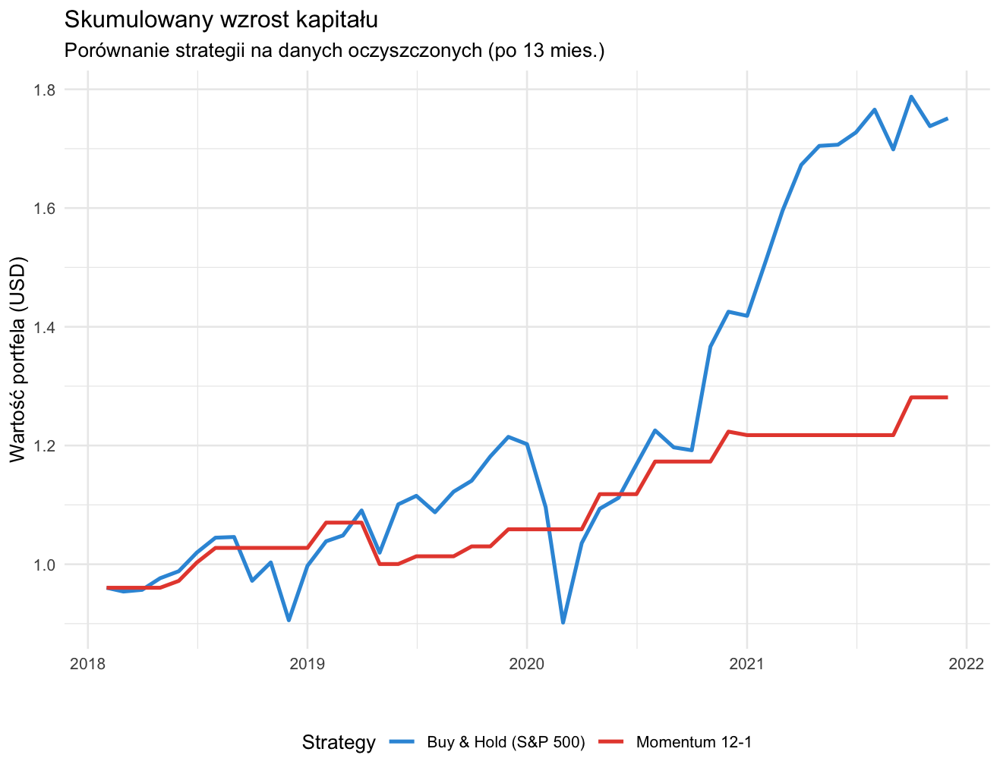
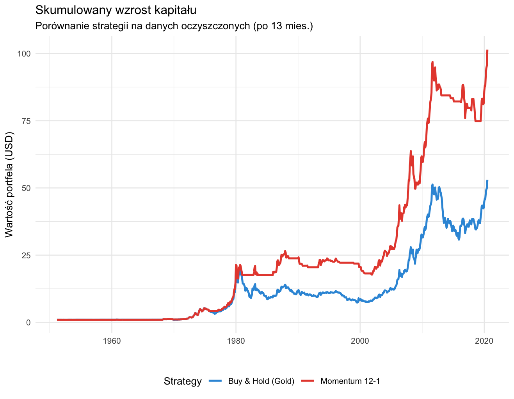
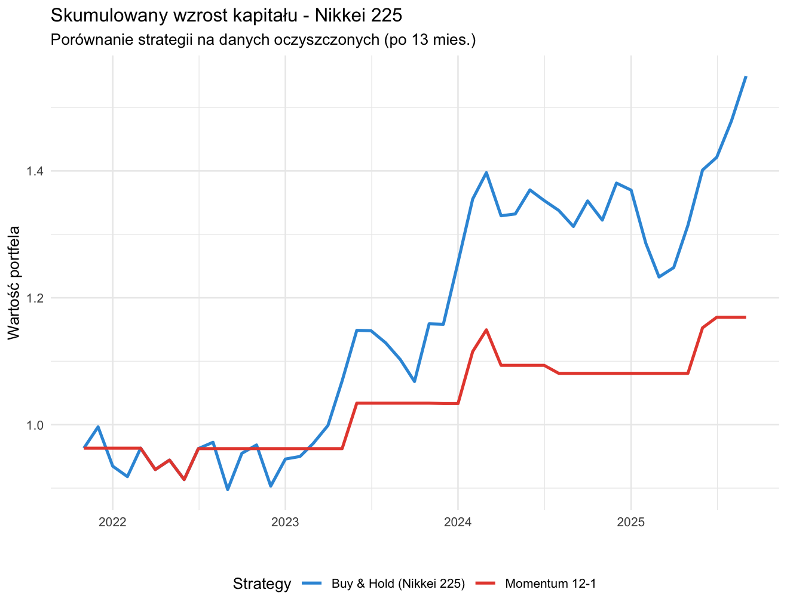

## 1. Wprowadzenie i cel analizy

Celem niniejszego raportu jest ocena efektywności aktywnej strategii **Momentum 12-1** w zestawieniu z pasywnym podejściem **Buy & Hold**. Analiza ma na celu sprawdzenie, czy prosta reguła podążania za trendem pozwala na poprawę relacji zysku do ryzyka oraz ochronę kapitału na trzech zróżnicowanych aktywach: S&P 500, Nikkei 225 oraz złocie.

## 2. Opis danych

Badanie przeprowadzono na podstawie historycznych szeregów czasowych dla:

1.  **S&P 500:** Reprezentacja rynku akcji USA.

2.  **Nikkei 225:** Główny indeks giełdy w Japonii.

3.  **Złoto (Gold):** Kluczowy surowiec inwestycyjny.

Dane obejmują ceny miesięczne, z których wyliczono logarytmiczne lub procentowe stopy zwrotu.

## 3. Opis strategii i metodologii

W raporcie porównano dwie metody inwestycyjne:

1.  **Buy & Hold (B&H):** Strategia pasywna polegająca na utrzymywaniu pozycji przez cały badany okres.
2.  **Momentum 12-1:** Strategia aktywna. Inwestycja następuje tylko wtedy, gdy stopa zwrotu z aktywa za okres ostatnich 12 miesięcy (z wyłączeniem ostatniego miesiąca) jest dodatnia. W przeciwnym razie kapitał pozostaje w gotówce (stopa zwrotu 0%).

Głównym miernikiem efektywności jest **wskaźnik Sharpe'a**, obliczony globalnie dla całego okresu badania:

$$Sharpe\ Ratio = \frac{R_p - R_f}{\sigma_p}$$

Gdzie:

\* $R_p$ – zannualizowana stopa zwrotu portfela.

\* $R_f$ – stopa wolna od ryzyka (przyjęto 3,47%).

\* $\sigma_p$ – zannualizowane odchylenie standardowe stóp zwrotu (zmienność).

\pagebreak

## 4. Wykresy skumulowanego wzrostu kapitału

Poniższe wykresy prezentują ścieżki kapitału dla obu strategii na poszczególnych aktywach (dane oczyszczone po 13 miesiącach rozruchu strategii Momentum).

### S&P 500

### Złoto

### Nikkei 225

\pagebreak

## 5. Wyniki ilościowe

Poniższa tabela przedstawia zbiorcze wyniki uzyskane podczas symulacji:

| Aktywo         | Strategia  | Śr. zysk roczny | Zmienność | Sharpe Ratio | Max Drawdown |
|:-----------|:-----------|:----------:|:----------:|:----------:|:----------:|
| **S&P 500**    | Buy & Hold |     18,92%      |  19,67%   |     0,65     |   -25,75%    |
|                | Momentum   |      5,21%      |   7,08%   |     0,44     |    -6,52%    |
| **Gold**       | Buy & Hold |      7,60%      |  14,86%   |     0,22     |   -62,02%    |
|                | Momentum   |      8,33%      |  12,87%   |     0,31     |   -33,05%    |
| **Nikkei 225** | Buy & Hold |     12,26%      |  14,98%   |     0,59     |   -11,94%    |
|                | Momentum   |      2,73%      |   8,25%   |     0,10     |    -8,65%    |

## 6. Interpretacja

### Porównanie stabilności i ryzyka

Kluczowym wnioskiem z analizy jest **zdolność strategii Momentum do drastycznej redukcji ryzyka**. We wszystkich trzech przypadkach maksymalne obsunięcie kapitału (Max Drawdown) było znacząco niższe dla strategii aktywnej. Najbardziej spektakularny wynik odnotowano na rynku złota, gdzie Momentum ograniczyło ryzyko straty o blisko połowę (z 62% do 33%).

### Statystyczna istotność wyników

Przeprowadzone testy t dla różnic średnich stóp zwrotu wykazały wartości **p-value** znacznie powyżej progu 0,05:

1.  **S&P 500:** 0,31

2.  **Gold:** 0,45

3.  **Nikkei 225:** 0,22

Oznacza to, że różnice w stopach zwrotu nie są statystycznie istotne. Wybór strategii Momentum nie gwarantuje statystycznie wyższych zysków, ale zmienia profil ryzyka portfela.

### Specyfika klas aktywów

Strategia Momentum wykazuje różną skuteczność w zależności od aktywa. Na silnie rosnącym rynku akcji (S&P 500) Momentum działa jako "hamulec", ograniczając zyski w zamian za spokój inwestycyjny. Na rynku złota, który cechuje się długimi trendami, Momentum poprawiło zarówno zysk, jak i bezpieczeństwo, co widać w najwyższym wzroście wskaźnika Sharpe'a (z 0,22 do 0,31).

## 7. Wnioski

1.  **Ochrona kapitału:** Strategia Momentum 12-1 jest skutecznym narzędziem obrony przed krachem, redukując zmienność i głębokość spadków.
2.  **Selektywność:** Strategia ta najlepiej sprawdza się na aktywach o wyraźnych, długoterminowych trendach (jak złoto), a gorzej na rynkach o dużej dynamice wzrostu (S&P 500).
3.  **Kompromis:** Inwestor wybierający Momentum musi liczyć się z "kosztem alternatywnym" – mniejszym zyskiem w okresach hossy w zamian za bezpieczeństwo w okresach bessy.
